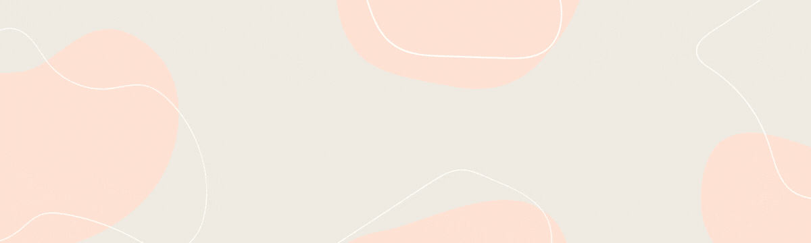

 
  
  

<!--   <a href="https://github.com/users/staceyjf/projects/4/views/3">📝 Personal Kanban board</a> -->

### Design ethos
With a background in communication planning, I bring a human-centric approach to software development. I believe that aligning the needs and experiences of end-users with business objectives in software design will yield greater tangible value and positive outcomes in adoption, ultimately leading to product success.

### Currently working on
- Having just completed the nology career switcher's programme, I'm building my second Spring Boot API with a postcode checker api. Check out my progress here: [Source Code](https://github.com/staceyjf/PostCheck-API)

### Key Projects

- **Spring Tasker**: a full-stack Todo app to make keeping up todate with your daily tasks that much easier.
    - Tech Stack: React, SpringBoot, TypeScript, React Testing Library, mySQL Log4J2, OpenAPI Git & GitHub 
    - [Source Code](https://github.com/staceyjf/SpringTasker)
- **JavaField**: a classic Minesweeper game powered by Java and played in the command-line interface
    - Tech Stack: Java
    - [Source Code](https://github.com/staceyjf/javaMineField)
- **theMarketPlace**: a react front-end luxury fashion ecom store.
    - Tech Stack: React, FireStore, JavaScript, Git & GitHub 
    - [Source Code](https://github.com/staceyjf/theMarketPlace) 
    - [Live Site](https://www.staceyfanner.com/theMarketPlace/)
- **Mayday Mum**: A JavaScript-powered childcare booking platform featuring token-based user authentication, designed to simplify the process of securing trusted childcare services for parents and caregivers. 
    - Tech Stack: MongoDB, Mongoose, Express, React, Node.js, Material UI, HTML5, CSS, Git & GitHub  
    - [Source Code](https://github.com/staceyjf/maydayMum)
- **Foliage Analyst**: A python-powered, go-to platform for plant enthusiasts seeking a seamless solution to monitor and nurture their leafy companions.  
    - Tech Stack: PostgreSQL, Django, AWS, unittest, Bootstrap 5, Crispy HTML5, CSS, Git & GitHub 
    - [Source Code](https://github.com/staceyjf/foliageAnalyst)
  
### How to Reach Me
Feel free to reach out to me at **staceyfanner@gmail.com** for collaboration, opportunities, or just to say hello! I'm always open to connecting with fellow developers and enthusiasts.

### In my toolbox, you will find:

### Languages:

### Frameworks:
)

### Libraries:

### Database:

### Other Tools:

